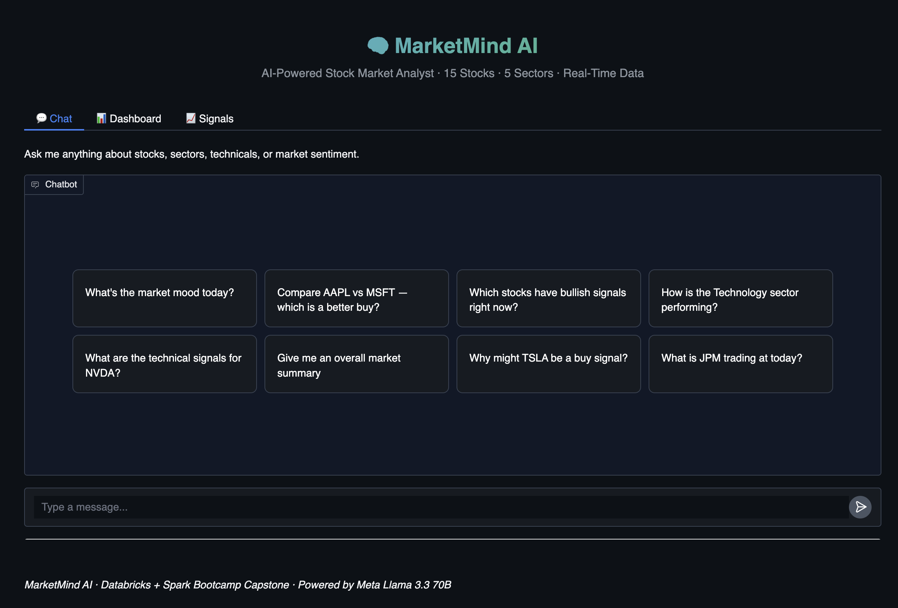
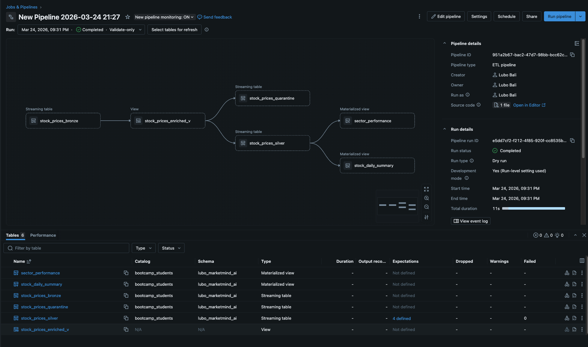
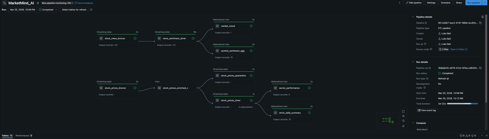
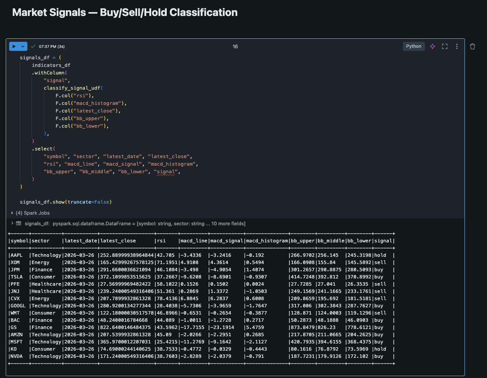
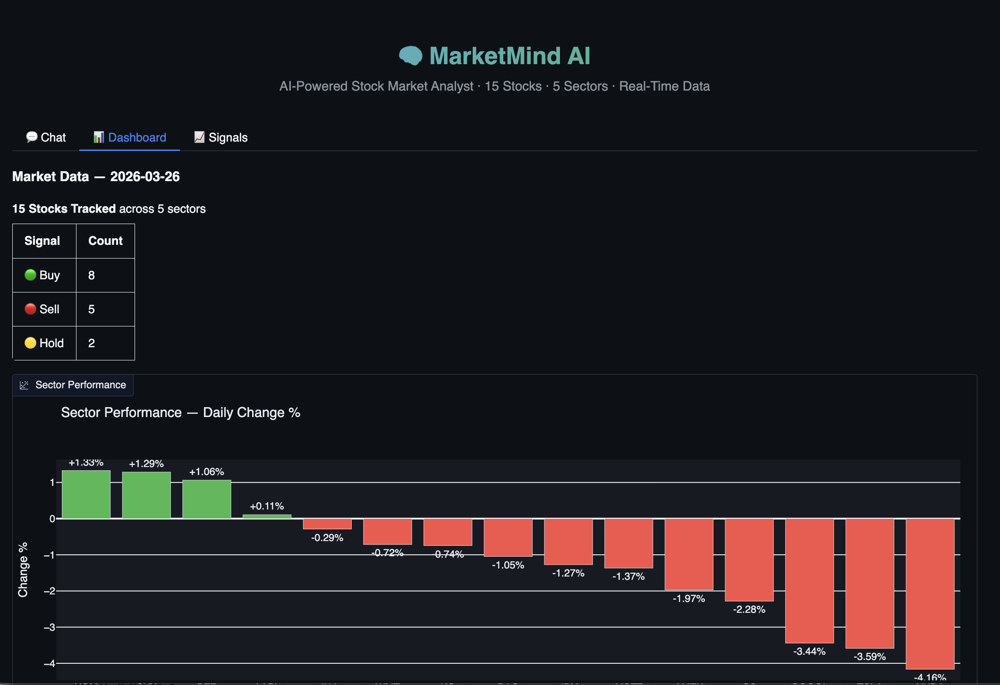
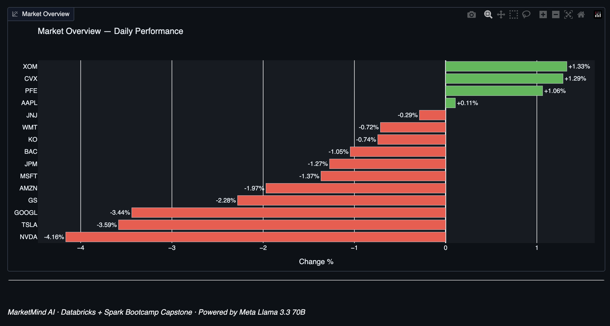
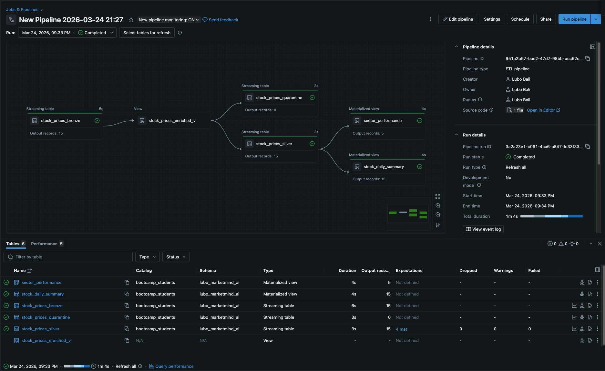

# MarketMind AI

**AI-Powered Stock Market Analyst** — Real-time streaming, NLP sentiment, technical analysis, and an AI agent that answers questions about it all.

Capstone project for the Databricks + Apache Spark Bootcamp. Covers all 5 modules: Delta Lake, Advanced Spark, Unstructured Data, Kafka Streaming, and AI Agents.



---

## Problem Statement

A retail investor cannot process the volume of real-time market data, news, and signals needed to make informed decisions. MarketMind AI solves this by streaming stock data, processing financial news with NLP, building a continuously updated data warehouse, and providing an AI agent that answers natural language questions about it all.

## Architecture

```
Yahoo Finance API ──┐
                    ├──► Spark Structured Streaming ──► Delta Live Tables
Financial News ────┘         (Bronze → Silver → Gold)
                                        │
                                        ├──► NLP Sentiment Pipeline (VADER + TextBlob)
                                        ├──► Advanced Spark Analytics (UDFs + Window Functions)
                                        ├──► AI Agent (Meta Llama 3.3 70B + Tool Calling)
                                        └──► Gradio UI (Chat + Dashboard + Signals)
```

## Tech Stack

| Technology | Usage |
|-----------|-------|
| **Databricks** | Workspace, clusters, notebooks, jobs |
| **Apache Spark** | Structured Streaming, DataFrames, SQL |
| **Delta Lake / DLT** | Medallion architecture (Bronze → Silver → Gold) |
| **Meta Llama 3.3 70B** | AI agent with function calling (Databricks Foundation Model) |
| **MLflow** | Experiment tracking, model registry |
| **Gradio** | Chat UI + dashboard (3 tabs) |
| **Plotly** | Dark-themed charts (sector heatmap, signals, market overview) |
| **VADER + TextBlob** | Dual-model sentiment analysis |
| **yfinance** | Stock price data (15 stocks, 5 sectors) |
| **Python** | All code, 308 tests |

## Delta Live Tables Pipeline

The medallion architecture processes raw stock prices and news through Bronze → Silver → Gold layers with data quality expectations. Zero quarantined records.

**Stock Price Pipeline** — streaming tables with 4 DLT expectations:



**News Sentiment Pipeline** — 131 articles processed with dual-model NLP scoring:



## Data Coverage

**15 stocks across 5 sectors:**

| Sector | Stocks |
|--------|--------|
| Technology | AAPL, MSFT, NVDA, GOOGL, AMZN |
| Finance | JPM, GS, BAC |
| Energy | XOM, CVX |
| Healthcare | PFE, JNJ |
| Consumer | TSLA, WMT, KO |

## Delta Lake Tables (15 total)

| Layer | Tables |
|-------|--------|
| **Bronze** | stock_prices_bronze, stock_news_bronze |
| **Silver** | stock_prices_silver, stock_prices_quarantine, news_sentiment_silver |
| **Gold** | stock_daily_summary, sector_performance, symbol_sentiment_agg, market_mood |
| **Analytics** | technical_indicators, market_signals, moving_averages, sector_rankings, volume_spikes |

## Advanced Spark Analytics

4 custom UDFs (RSI, MACD, Bollinger Bands, signal classifier) and window functions (SMA, VWAP, sector ranking, volume spike detection). All tables partitioned by date and Z-ordered by symbol.

Buy/Sell/Hold classification computed from RSI + MACD + Bollinger Bands:



## AI Agent

The MarketMind AI agent uses **Meta Llama 3.3 70B Instruct** with function calling to query Delta tables and answer natural language questions.

**6 tools:**
- `get_stock_price` — Latest price, change, volume
- `get_sector_performance` — Sector rankings, gainers/losers
- `get_market_sentiment` — Per-symbol or market-wide news sentiment
- `get_technical_signals` — RSI, MACD, Bollinger Bands, buy/sell/hold
- `compare_stocks` — Side-by-side comparison of two stocks
- `get_market_summary` — Top gainers, losers, most active, volume spikes

**Performance:** 6 test queries, avg 2.62s latency, multi-step reasoning (up to 4 tool calls per query).

## Gradio UI

3-tab interface: Chat (AI agent with 8 example questions), Dashboard (sector heatmap + market overview), and Signals (technical signal table).

**Dashboard** — 15 stocks tracked, signal distribution, sector performance chart:



**Market Overview** — All stocks ranked by daily performance:



**Full DLT Pipeline DAG** — Both pipelines running in Databricks:



## Bootcamp Module Coverage

| Module | Coverage |
|--------|----------|
| **Module 2 — Delta Lake** | Bronze/Silver/Gold tables, DLT expectations, quarantine, time travel |
| **Module 3 — Advanced Spark** | 4 UDFs (RSI, MACD, Bollinger, signal classifier), window functions (SMA, VWAP, ranking, volume spikes), Z-ordering, partitioning |
| **Module 4 — Unstructured Data** | Financial news NLP, dual-model sentiment (VADER + TextBlob), entity extraction |
| **Module 5 — Kafka Streaming** | Real-time price + news ingestion via Spark Structured Streaming |
| **Module 6 — AI Agents** | Llama 3.3 70B with tool calling, MLflow tracking, Gradio UI |

## Project Structure

```
marketmind-ai/
├── databricks_notebooks/
│   ├── 01_kafka_producer.py        # Stock price streaming to DBFS
│   ├── 02_dlt_pipeline.py          # Bronze → Silver → Gold (DLT)
│   ├── 03_news_pipeline.py         # News NLP + sentiment (DLT)
│   ├── 04_news_producer.py         # News ingestion from APIs
│   ├── 05_advanced_analytics.py    # UDFs + window functions
│   ├── 05a_seed_historical_data.py # Seed 60 days of yfinance data
│   ├── 06_ai_agent.py             # AI agent + MLflow tracking
│   └── 07_gradio_ui.py            # Gradio chat + dashboard
├── utils/
│   ├── agent.py                    # Agent loop (testable, no Spark)
│   ├── agent_tools.py              # 6 agent tools (pure Python)
│   ├── gradio_app.py               # Chart builders + chat handler
│   ├── sentiment.py                # VADER + TextBlob scoring
│   └── technical_indicators.py     # RSI, MACD, Bollinger UDFs
├── config/
│   ├── schemas.py                  # Spark StructType definitions
│   └── settings.py                 # Paths, API config, stock list
├── tests/                          # 308 tests (unit + integration)
├── docs/screenshots/               # Pipeline DAGs, UI screenshots
├── requirements.txt
└── pyproject.toml                  # Ruff + pytest config
```

## How to Run

### Prerequisites
- Databricks workspace with a cluster (DBR 15+)
- Unity Catalog enabled (catalog: `bootcamp_students`)

### Steps

1. **Clone the repo** and upload notebooks to Databricks

2. **Seed data** — Run `05a_seed_historical_data.py` to load 60 days of stock history

3. **Run DLT pipelines:**
   - Create pipeline from `02_dlt_pipeline.py` (stock prices)
   - Create pipeline from `03_news_pipeline.py` (news + sentiment)

4. **Run analytics** — `05_advanced_analytics.py` (computes RSI, MACD, Bollinger, rankings)

5. **Test the agent** — `06_ai_agent.py` (6 test queries + MLflow logging)

6. **Launch the UI** — `07_gradio_ui.py` (opens Gradio with public URL)

### Local Testing

```bash
pip install -r requirements.txt
python -m pytest tests/ -q    # 308 tests
ruff check .                  # Linting
```

## Stats

- **308 tests** (unit + integration) — all passing
- **15 Delta tables** across Bronze/Silver/Gold/Analytics layers
- **131 news articles** processed with dual-model NLP
- **6 AI agent tools** with multi-step reasoning
- **2.62s avg latency** per agent query
- **Pre-commit hooks** (ruff lint + format + pytest)
- **CI pipeline** (Forgejo Actions on every push)

---

*Built by [Lubo Bali](https://github.com/lubobali) — Databricks + Apache Spark Bootcamp Capstone, March 2026*
